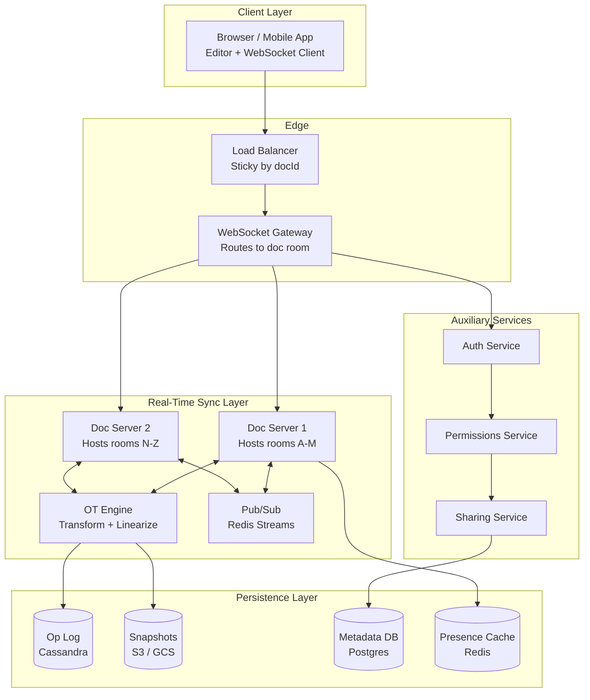
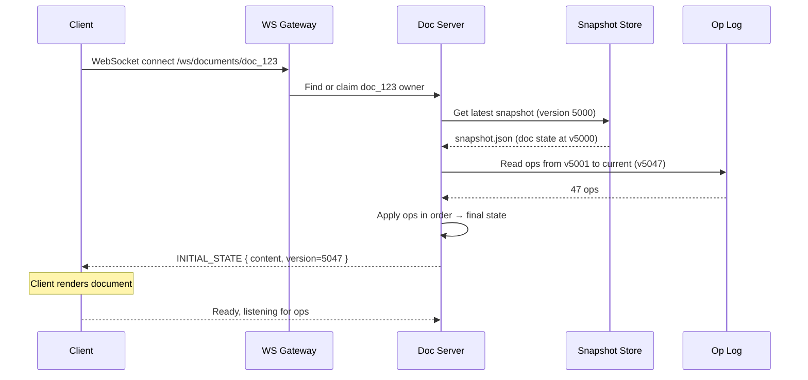
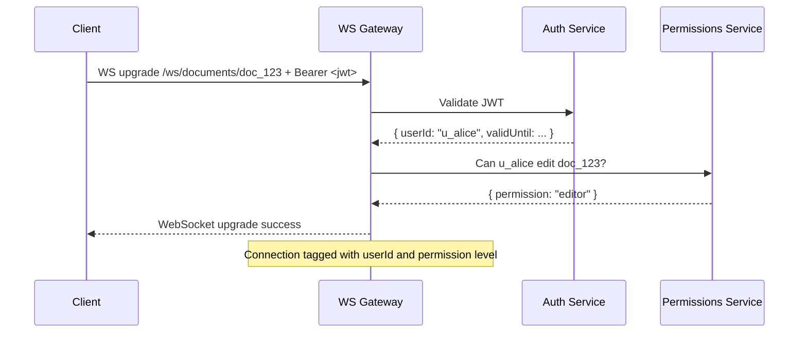

# P01 — Designing Google Docs
## The Complete System Design Walkthrough for Real-Time Collaborative Editing

> **Series:** Learn to Think Like an Architect  
> **Level:** Junior → Senior → Staff  
> **Companion piece:** [Operational Transformation Deep Dive](./P01_Operational_Transformation_Google_Docs.md)

---

## The Problem

> *"Design a system like Google Docs that allows multiple users to edit a document simultaneously. Each user must be able to undo their own changes without undoing other users' work. The document must stay consistent across all users."*

This is one of the most loved system design interview questions. It looks innocent. It hides almost every distributed systems problem you have ever heard of:

- Concurrent state mutation across many clients
- Eventual vs strong consistency
- Real-time bidirectional communication
- Per-user undo across shared state
- Conflict resolution under network partitions
- Scale: 5 users in one doc... or 50, or 500?
- Persistence: how do you store a billion documents that change every second?
- Permissions, security, audit logs

We will work through this the way an architect would actually approach it — start with questions, narrow scope, then build outward.

---

## Step 1 — Clarify Before You Design

The first thing an architect does is **refuse to start designing**. Junior engineers jump to the whiteboard. Architects ask questions.

### Functional Requirements (what we will support)

```
✓ Multiple users can open and edit the same document concurrently
✓ Edits propagate to all collaborators in near real time (< 1s)
✓ Each user can undo and redo their own edits — not others'
✓ Cursors and selections of other users are visible
✓ Document is auto-saved continuously (no manual "Save" button)
✓ Document survives client disconnections and reconnections
✓ Documents can be shared with view / comment / edit permissions
✓ Plain text editing — bold, italic, lists are out of scope for v1
```

### Non-Functional Requirements

```
✓ Latency:       edits appear on other clients in < 300ms (P95)
✓ Availability:  99.95% — at most 4 hours downtime per year
✓ Consistency:   eventual consistency is acceptable; all clients must
                 converge to the same state within seconds
✓ Durability:    no acknowledged edit is ever lost
✓ Scale:         100M active users, ~1B documents, peak 1M concurrent
                 editing sessions
✓ Concurrent editors per doc: 50 typical, 100 hard limit
```

### Explicitly Out of Scope (for this interview)

```
✗ Rich text formatting (defer to v2 — same architecture, just richer ops)
✗ Comments and suggestions (defer to v2)
✗ Mobile sync nuances (the protocol is the same, the UI differs)
✗ Search across documents (a separate indexing system)
```

**Architect's note:** Defining what is *out of scope* is as important as defining what is in. It tells the interviewer you can prioritize.

---

## Step 2 — Back-of-the-Envelope Scale Estimation

Before drawing boxes, estimate the load. This shapes everything that follows.

```
Daily Active Users (DAU):              100,000,000
Avg docs edited per user per day:      3
Total document edit sessions / day:    300,000,000

Avg characters typed per session:      ~300 characters
Avg operations per session:            ~300 (one op per char in worst case)

Operations per second (average):       300M × 300 / 86400 = ~1M ops/sec
Operations per second (peak, 5×):      ~5M ops/sec

Storage:
  Avg document size:                   50 KB
  Total documents:                     1B × 50KB = 50 TB raw
  With version history (10x):          ~500 TB
  Op log (append-only, ~30 days hot):  ~5 TB hot, archived to cold storage

Bandwidth per active editor:           ~500 bytes/sec (ops + presence)
Total realtime bandwidth (peak):       1M concurrent × 500 = 500 MB/s
```

These are the numbers that drive the architecture. ~5M peak ops/sec means we cannot have a single server. ~500 TB means we need distributed storage. ~1M concurrent connections means we need a real-time gateway that can handle long-lived connections at scale.

---

## Step 3 — High-Level Architecture

Here is the architecture, drawn the way you should draw it in an interview:



### What each component does

| Component | Responsibility |
|-----------|----------------|
| **Client** | Renders the document. Captures keystrokes. Sends operations. Receives operations. Applies them optimistically, reconciles when server ACKs |
| **Load Balancer** | Routes WebSocket connections. Sticky by `docId` so all editors of the same doc land on the same WS gateway when possible |
| **WebSocket Gateway** | Manages long-lived bidirectional connections. Authenticates. Forwards ops to the right Doc Server |
| **Doc Server** | The "owner" of a set of document rooms. Each doc has one authoritative server. Linearizes ops, runs OT, broadcasts |
| **OT Engine** | Transforms incoming ops against concurrent ops. Stamps version numbers. (Or CRDT engine, see Step 5) |
| **Op Log** | Append-only storage of every operation ever applied to every document. System of record |
| **Snapshot Store** | Periodic compactions of the document state for fast loading |
| **Metadata DB** | Document ownership, sharing rules, ACLs, title, last modified, etc |
| **Presence Cache** | Ephemeral data: who's online, where their cursor is. Disposable |
| **Auth / Permissions** | Verify the user has access to the doc and at what level (view/comment/edit) |

---

## Step 4 — API Design

The interface that matters most is the WebSocket protocol — but there are also a few HTTP endpoints for document management.

### HTTP API (Document Lifecycle)

```
POST   /documents                    Create a new document
GET    /documents/{docId}            Get document metadata + initial snapshot
PUT    /documents/{docId}/permissions Update sharing/ACL
GET    /documents/{docId}/history    Paginated op history (for audit)
DELETE /documents/{docId}            Soft delete
```

### WebSocket API (Real-Time Editing)

After authenticating and opening a WebSocket to `/ws/documents/{docId}`:

**Client → Server messages:**

```json
{
  "type": "OPERATION",
  "docId": "doc_123",
  "clientId": "u_alice",
  "basedOnVersion": 47,
  "op": {
    "type": "insert",
    "position": 12,
    "text": "hello"
  },
  "opId": "op_abc123",
  "timestamp": 1735200000000
}
```

```json
{
  "type": "CURSOR_UPDATE",
  "position": 12,
  "selectionStart": 12,
  "selectionEnd": 17
}
```

```json
{
  "type": "UNDO",
  "clientId": "u_alice",
  "lastOpId": "op_abc123"
}
```

**Server → Client messages:**

```json
{
  "type": "OPERATION_BROADCAST",
  "version": 48,
  "op": { "type": "insert", "position": 12, "text": "hello" },
  "originatingClient": "u_alice"
}
```

```json
{
  "type": "ACK",
  "opId": "op_abc123",
  "serverVersion": 48
}
```

```json
{
  "type": "PRESENCE",
  "users": [
    { "clientId": "u_alice", "cursor": 12, "color": "#4a9aff" },
    { "clientId": "u_bob",   "cursor": 5,  "color": "#ff9a4a" }
  ]
}
```

---

## Step 5 — The Real-Time Sync Algorithm (The Hard Part)

This is the core technical decision. We have two families of algorithms:

### Option A — Operational Transformation (OT)

> Centralized server transforms each incoming operation against the operations that have happened since the client last synced.

- ✓ Server is the single point of serialization — clean, deterministic ordering
- ✓ Simpler undo semantics
- ✓ Used by Google Docs, Etherpad
- ✗ Server is a bottleneck per doc — single doc cannot scale horizontally
- ✗ Cannot work offline without sync conflicts

### Option B — Conflict-Free Replicated Data Types (CRDT)

> Operations are designed mathematically so that any order of application produces the same result. No transformation needed.

- ✓ No central server required — works peer-to-peer
- ✓ Works offline; syncs when reconnected
- ✗ Larger memory footprint (each character carries metadata)
- ✗ More complex undo semantics
- ✓ Used by Figma, Notion (partial), Automerge, Yjs

### Decision for our system

> **For Google Docs-style collaboration, OT is the right choice.** We have a central server, we control the topology, and we need clean per-user undo. CRDT's offline benefit doesn't matter much for a primarily online product.

**See the companion piece for the algorithm in detail:** [P01 — Operational Transformation Deep Dive](./P01_Operational_Transformation_Google_Docs.md)

### The OT server loop (simplified)

```java
public class DocServer {

    private int currentVersion = 0;
    private final List<Operation> opLog = new ArrayList<>();
    private final Set<ClientConnection> clients = new HashSet<>();

    public synchronized void handleClientOp(ClientOp clientOp) {
        // 1. Transform against all ops that happened after the client's basedOnVersion
        Operation op = clientOp.getOp();
        for (int v = clientOp.getBasedOnVersion(); v < currentVersion; v++) {
            op = OperationalTransform.transform(op, opLog.get(v));
        }

        // 2. Apply and version
        currentVersion++;
        op.setVersion(currentVersion);
        opLog.add(op);

        // 3. Persist asynchronously
        opLogStore.appendAsync(op);

        // 4. Broadcast transformed op to all clients
        for (ClientConnection client : clients) {
            if (client.getClientId().equals(clientOp.getClientId())) {
                client.send(new Ack(clientOp.getOpId(), currentVersion));
            } else {
                client.send(new OperationBroadcast(op));
            }
        }

        // 5. Periodically snapshot
        if (currentVersion % SNAPSHOT_INTERVAL == 0) {
            snapshotAsync();
        }
    }
}
```

---

## Step 6 — Data Model

### Op Log Table (Cassandra)

```sql
CREATE TABLE op_log (
  doc_id          TEXT,
  version         BIGINT,
  client_id       TEXT,
  op_type         TEXT,         -- 'insert' | 'delete' | 'retain'
  position        INT,
  content         TEXT,
  parent_op_id    TEXT,         -- for undo chain
  created_at      TIMESTAMP,
  PRIMARY KEY (doc_id, version)
) WITH CLUSTERING ORDER BY (version ASC);
```

- Partitioned by `doc_id` — all ops for one doc on the same partition, supports fast sequential reads
- Clustered by `version` — naturally sorted for replay

### Snapshot Table

```sql
CREATE TABLE snapshots (
  doc_id          TEXT PRIMARY KEY,
  version         BIGINT,
  snapshot_url    TEXT,         -- pointer to S3 / GCS object
  created_at      TIMESTAMP
);
```

Every N ops (e.g., 1000), the doc server uploads the materialized document state to object storage and records the version.

### Document Metadata (Postgres)

```sql
CREATE TABLE documents (
  doc_id          UUID PRIMARY KEY,
  title           TEXT NOT NULL,
  owner_id        UUID NOT NULL,
  created_at      TIMESTAMP NOT NULL,
  last_modified   TIMESTAMP NOT NULL,
  current_version BIGINT NOT NULL,
  is_deleted      BOOLEAN DEFAULT FALSE
);

CREATE TABLE document_permissions (
  doc_id          UUID,
  user_id         UUID,
  permission      TEXT,         -- 'owner' | 'editor' | 'commenter' | 'viewer'
  granted_at      TIMESTAMP,
  PRIMARY KEY (doc_id, user_id)
);
```

### Presence (Redis)

```
Key:    presence:{docId}
Type:   Hash
Value:  { userId → {cursor: 12, color: "#4a9aff", lastSeen: 1735200000} }
TTL:    30 seconds (refreshed by client heartbeat)
```

When a user disconnects, their presence entry simply expires. No cleanup logic needed.

---

## Step 7 — Loading a Document

When a client opens a document:



**Why snapshot + ops?** Replaying 5 million ops every time someone opens a doc would be insane. The snapshot is the fast path; the recent op log is the cheap delta.

---

## Step 8 — Selective Undo (The Genuinely Hard Part)

Naive undo: pop the last op off the stack. Doesn't work — the last op might be someone else's.

OT undo algorithm:

1. Each user maintains their own personal undo stack (just `opId`s).
2. When the user hits Ctrl+Z:
   - Look up their last op in the op log
   - Compute its **inverse** (`Insert("hello", pos=0)` → `Delete(pos=0, len=5)`)
   - **Transform the inverse against every op that happened after the original**
   - Apply the transformed inverse — this becomes a new op in the log
3. Push the inverse op onto the user's redo stack.

```
Original log:
  v100: alice  insert("hello", pos=0)
  v101: bob    insert(" world", pos=5)
  v102: alice  hits Ctrl+Z

To undo alice's v100:
  inverse(v100) = delete(pos=0, len=5)
  transform delete(0,5) against insert(" world", pos=5) at pos 5
    → no overlap, no shift
    → delete(pos=0, len=5)
  Apply → doc becomes " world"
  Log entry v103 = delete(pos=0, len=5) by alice (undo of v100)

Bob's " world" is untouched. Alice's "hello" is gone. Intention preserved.
```

For the full algorithm, see the [companion OT deep dive](./P01_Operational_Transformation_Google_Docs.md).

---

## Step 9 — Scaling Strategy

### Sharding by Document

Each document has one **authoritative doc server** at a time. We shard by `docId`:

```
docServerForDoc(docId) = consistent_hash(docId) % numDocServers
```

Properties:
- All editors of doc X always land on the same doc server → no coordination overhead between doc servers for a single doc
- Different docs are distributed across the cluster → horizontal scaling
- A doc server going down means a small subset of docs need to be re-homed

### Cross-Region

For users editing the same doc from different continents:

```
Option 1 (simple): Pin each doc to one region globally. Users in other 
regions pay the latency cost to reach the doc's home region.

Option 2 (advanced): Use a leader-election scheme. The first user opens 
the doc in region X, that region becomes the leader. Users in other 
regions become followers and route ops through. If the leader fails, 
election happens (Paxos or Raft).

For an interview, Option 1 is fine and shows good judgement.
```

### Pub/Sub Between Doc Servers

When a doc is hosted on doc server A, and a client connects via WS gateway 2 which talks to doc server A — that's fine. But what about presence? Presence broadcast to all clients of a doc happens via Redis Pub/Sub channels (`presence:doc_123`).

---

## Step 10 — Fault Tolerance

### What if the doc server crashes mid-edit?

```
1. Last ACK'd op was v47 (persisted to op log).
2. Doc server crashes before persisting v48.
3. Client retries v48 (with same opId).
4. New doc server picks up doc_123, loads snapshot + op log to v47.
5. New doc server sees client's v48 (basedOn v47), processes it.
6. No data loss. Op never made it past the server, so it never claimed to.
```

**Key principle:** an op is "committed" only after it appears in the op log. The server ACKs only after persistence. Clients retry on disconnect — idempotent via `opId`.

### What if the client disconnects?

```
1. Client buffers unsent ops locally.
2. Reconnects to (potentially different) WS gateway.
3. Sends "RESYNC basedOnVersion=47" — server replies with all ops since v47.
4. Client applies them.
5. Client retransmits its buffered ops with their original opIds.
6. Server deduplicates by opId — if an op was already applied, it ACKs without reapplying.
```

### What if Cassandra is slow?

The doc server applies ops in-memory and ACKs the client *after* successful persistence — but persistence is on the hot path. If Cassandra slows down, write latency increases. Options:

- **Async persistence with confirmation:** ACK client only after both in-memory apply *and* op log write. Cassandra slowness becomes user-visible latency. **This is the right default.**
- **Write-ahead local log:** Doc server writes to a local SSD log first, ACKs, then async to Cassandra. Faster but risks loss if the doc server dies before Cassandra catches up. **Acceptable only with multi-replica doc servers.**

---

## Step 11 — Security & Permissions

Every WebSocket connection is authenticated:



If the permission is "viewer" or "commenter":
- Server rejects OPERATION messages
- Server still sends OPERATION_BROADCAST messages so the viewer sees live changes

### Permission changes mid-session

If the owner revokes a collaborator's access while they're editing:
1. Permissions service emits a `PERMISSION_CHANGED` event
2. WS gateway force-disconnects affected sessions
3. Their next reconnect attempt fails the permission check

---

## Step 12 — Observability

The metrics that matter:

```
Real-time health:
  - ws_active_connections           (gauge)
  - ops_per_second_per_doc          (histogram)
  - op_apply_latency_ms             (P50, P95, P99)
  - op_broadcast_fanout_ms          (P50, P95, P99)

Persistence:
  - op_log_write_latency_ms
  - snapshot_creation_latency_ms
  - cassandra_pending_writes

Correctness:
  - convergence_check_failures      (CRITICAL — should be 0)
  - undo_transformation_failures    (CRITICAL — should be 0)
  - duplicate_op_id_rejections      (informational — expected during retries)

Doc-level:
  - concurrent_editors_per_doc      (gauge, alert if > 100)
  - presence_cache_hit_rate
```

The most important metric is **convergence_check_failures** — periodically, the system can hash the document state across clients and verify all hashes match. Any mismatch indicates a critical OT bug.

---

## Step 13 — Trade-Offs Made and Documented

The architect's job is not making "right" choices — it is making **defensible** ones. Here are the trade-offs:

| Decision | What We Chose | What We Gave Up | Why |
|----------|---------------|-----------------|-----|
| OT vs CRDT | OT | Offline-first editing | Central server is simpler; offline is rare for docs |
| Single doc server | One owner per doc | Doc-level horizontal scaling | Eliminates coordination overhead. 100-editor cap is acceptable |
| Cassandra for ops | Append-optimized, partition-tolerant | Complex queries on op data | Op log is naturally append-only; queries are by docId |
| Postgres for metadata | Transactional, joins | Web-scale write throughput | Metadata writes are low volume |
| Stickiness by docId | Same doc, same server | Some load imbalance possible | Vastly simpler routing model |
| Async op log persist | Lower latency | Risk of losing ops on server crash | We chose sync persist for safety; doc serves stay fast via batching |
| 100 concurrent editor cap | Predictable doc-server load | Cannot support massive collaborative docs | Real-world data shows >95% of docs have <10 editors |

---

## Step 14 — Failure Scenarios to Walk Through

In an interview, after laying out the design, the interviewer will ask "what if..." questions. Prepare for these:

### "What if two users hit Ctrl+Z at the exact same millisecond?"
Both undo ops arrive at the doc server. They are serialized (since the doc server is single-threaded per doc), each transformed against the other, and both applied in sequence. Each user gets their own intent preserved.

### "What if the snapshot store is unavailable?"
Doc server loads documents purely by replaying the op log from version 0. Slower, but correct. New ops are still served in real time — snapshotting is a background optimization, not on the critical path.

### "What if a malicious client sends ops with fake clientIds?"
ClientId is server-assigned at WebSocket upgrade time based on the authenticated user. Server ignores client-supplied clientId; uses the one from the auth context.

### "What if a user's op queue grows unbounded due to network issues?"
Client caps its buffer (e.g., 1000 ops). If exceeded, client enters a "must reload" state and refetches the document from scratch. Better to inconvenience one user than to risk runaway memory.

### "What if doc_123 suddenly gets 1000 editors (e.g., viral document)?"
Doc server starts hitting limits. Two strategies:
1. **Graceful degradation:** rate-limit new connections, queue overflow, send "doc is over capacity, try again" responses.
2. **Read replicas:** for read-only viewers (no edit perms), route them to read replica servers that just receive the broadcast stream and don't participate in linearization.

### "What if the entire region goes down (Chaos Kong)?"
Active-active multi-region. Each region has its own doc servers. Pub/Sub across regions for cross-region ops. Cassandra cross-region replication. (Same lessons from Chaos Kong apply — see Day 52 in the SystemDesignInterview series.)

---

## Step 15 — A Diagram for the Whiteboard

When asked "draw it for me," draw exactly this:

```
   ┌──────────┐        ┌─────────────┐
   │ Browser  │  WS    │  Edge       │
   │ + Editor ├───────►│  LB + WSGW  │
   └──────────┘        └──────┬──────┘
                              │
                ┌─────────────┼─────────────┐
                │             │             │
                ▼             ▼             ▼
          ┌──────────┐ ┌──────────┐ ┌──────────┐
          │ Doc Svr  │ │ Doc Svr  │ │ Doc Svr  │
          │   #1     │ │   #2     │ │   #N     │
          │ (OT eng) │ │ (OT eng) │ │ (OT eng) │
          └────┬─────┘ └────┬─────┘ └────┬─────┘
               │            │            │
               │      ┌─────┴────┐       │
               └─────►│ Pub/Sub  │◄──────┘
                      │ (Redis)  │
                      └──────────┘
                            │
        ┌───────────────────┼───────────────────┐
        ▼                   ▼                   ▼
   ┌──────────┐       ┌──────────┐       ┌──────────┐
   │ Op Log   │       │ Snapshot │       │ Metadata │
   │(Cassandra)│      │ (S3/GCS) │       │(Postgres)│
   └──────────┘       └──────────┘       └──────────┘
```

The cleaner you draw, the more confident you sound. Practice this diagram.

---

## What an Architect Thinks vs What a Developer Thinks

This entire walkthrough is also a study in the architect mindset. At each step, the developer's instinct and the architect's instinct diverge:

| Developer asks | Architect asks |
|----------------|----------------|
| "How do I sync the text?" | "What is the convergence guarantee, and how do I verify it?" |
| "What database should I use?" | "What is the workload pattern, and what storage matches it?" |
| "How does Ctrl+Z work?" | "Whose stack owns the undo state, and how does it transform under concurrent edits?" |
| "Just use Kafka." | "What is the latency budget? Does Kafka fit it? What does it cost in ops complexity?" |
| "Add a cache." | "Cache what? With what consistency guarantee? Who invalidates it?" |
| "Make it scalable." | "What is the bottleneck? Doc server CPU? Op log write throughput? WS connection count? Each has a different solution." |

That difference — *what to ask before what to build* — is what we are practicing every time we work through a problem like this.

---

## Interview Prep Checklist

When you walk into a Google Docs system design interview, hit these beats in order:

```
1. ✅ Clarify functional and non-functional requirements
2. ✅ Scale estimation (DAU, ops/sec, storage, bandwidth)
3. ✅ High-level architecture (5–8 components)
4. ✅ API design (WS protocol + HTTP endpoints)
5. ✅ Choice of sync algorithm with reasoning (OT vs CRDT)
6. ✅ Data model for op log, snapshots, metadata, presence
7. ✅ Loading a doc (snapshot + delta replay)
8. ✅ Selective undo algorithm
9. ✅ Sharding strategy (by docId)
10. ✅ Fault tolerance (server crash, client disconnect, slow DB)
11. ✅ Security (auth, permissions, mid-session revocation)
12. ✅ Observability metrics (especially convergence)
13. ✅ Trade-offs documented with reasoning
14. ✅ Failure scenarios walked through
```

If you cover these in 45 minutes with reasonable depth, you have given a senior-level answer.

---

## Companion Reading

- **[Operational Transformation Deep Dive](./P01_Operational_Transformation_Google_Docs.md)** — the algorithm in full detail
- **[Excalidraw Diagram of OT Collision](./P01_OT_Diagram.excalidraw)** — the visual walkthrough

---

## The Architect's Closing Thought

> *"Most of system design is not knowing how to build it. It is knowing what questions to ask before you do."*

Every component in the Google Docs design exists because some question was asked: *what if two users edit at once? what if a client disconnects? what if the DB is slow? what if 1000 people open the same doc?* Each question, answered, becomes a piece of architecture.

The senior engineer learns to spot bottlenecks. The architect learns to **enumerate the questions** before drawing the first box.

---

*P01 · Learn to Think Like an Architect · [YouTube](https://www.youtube.com/@CodeWithSunchitDudeja) · [Instagram](https://www.instagram.com/sunchitdudeja/)*
